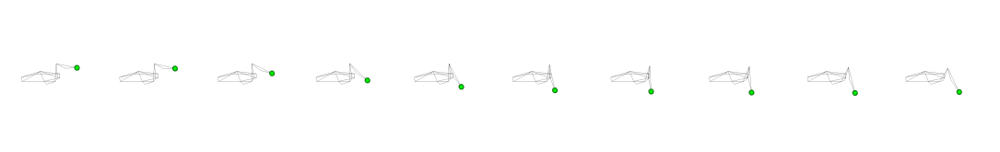
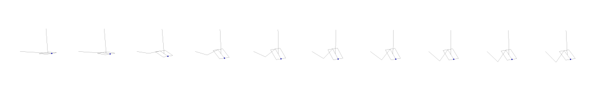
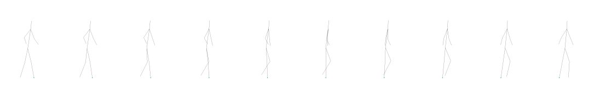

# Introduction
This repository contains the source code for a future article to be submitted.
It investigates the effect of
Direct multiple shooting and direct collocation with predictive simulation in biomechanics.

The repository is made available as accompanying material of [the future publication]():

```bibtex
@article{Puchaud2023,
  title={},
  author={Puchaud, Pierre and Bailly, François and Begon, Mickael},
  journal={},
  volume={},
  number={},
  pages={},
  year={2023},
}
```
and includes scripts, models and materials to reproduce figures and results of that work.


## Status

| Type | Status |
|---|---|
| License | <a href="https://opensource.org/licenses/MIT"></a> |
| Zenodo  | [](https://zenodo.org/badge/latestdoi/7591518) |

# Requirements
In order to run the code, you need to install the following packages from pyomeca:
```bash
conda install -c conda-forge biorbd=1.9.9
conda install -c conda-forge bioviz=2.3.0
conda install -c conda-forge bioptim=3.0.0
```

Extra dependencies are required to run the code.
- plotly: <a href="https://plot.ly/python/">plotly</a>
- pandas: <a href="https://pandas.pydata.org/">pandas</a>

# Contents from the paper

Direct multiple shooting (DMS) and direct collocation (DC) are two transcription methods for solving optimal control problems (OCP) used in biomechanics and robotics.
They have rarely been compared in terms of solution and speed.
Through five examples of predictive simulations solved using five transcription methods and 100 initial guesses in the Bioptim software,
we showed that not a single method outperformed systematically better.
All methods converged to almost the same solution (cost, states, and controls) in all but one OCP.
Several local minima were found in the latter.
Nevertheless, DC based on fourth-order Legendre polynomials provided overall better results, especially in terms of dynamic consistency compared to DMS based on fourth-order Runge-Kutta.
Expressing the rigid-body constraints using inverse dynamics was usually faster than forward dynamics.
DC with rigid-body dynamics constraints based on inverse dynamics converged to better and less variable solutions.
Consequently, we recommend starting with DC with rigid-body dynamics constraints based on inverse dynamics to solve OCPs but keep testing other transcription methods.
Bioptim allows the user to change the transcription method easily.

# Examples

Five examples are available in the `examples` folder from torque driven to muscle driven simulations.









